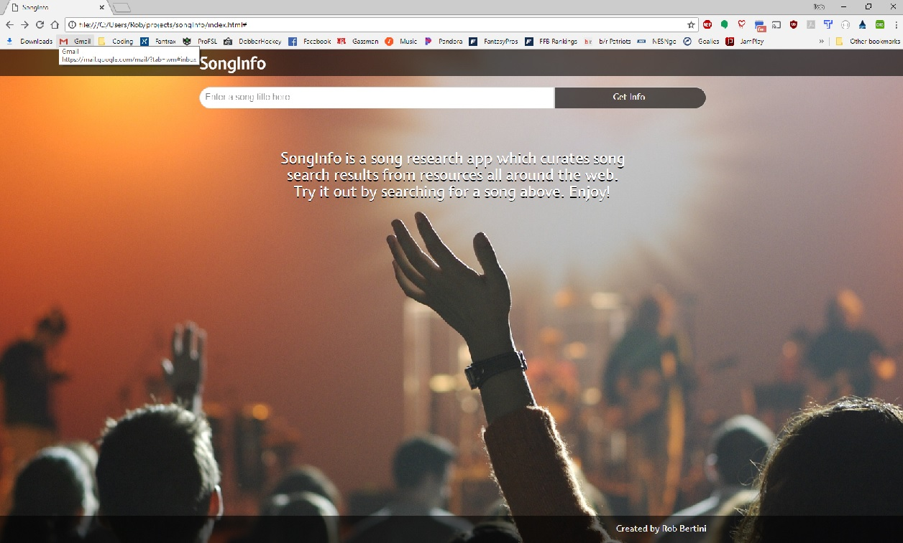
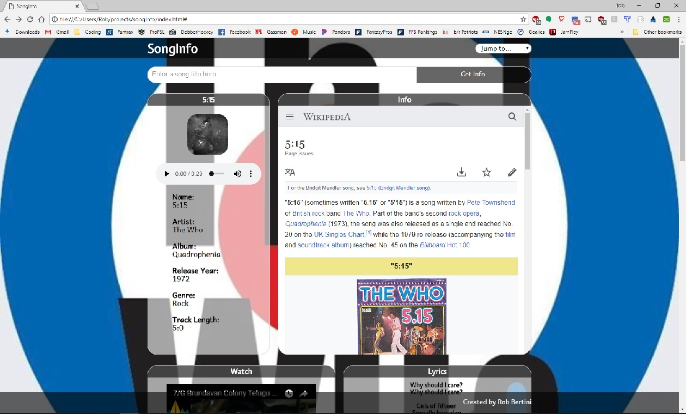
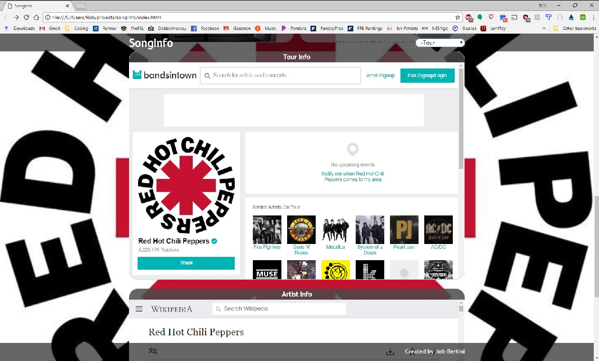

<h1>SongInfo</h1>

A song research application.
 

<h2>Summary</h2>

Users enter the name of a song they want to learn about and are returned results including song meanings, lyrics, reviews, artist information, videos, tour information from various API's including iTunes, Bandsintown, Musixmatch, Wikipedia, Youtube and Lyrics.ovh.
 

<h2>Live app:</h2>

https://robb42.github.io/songInfo/
 

<h2>Screenshots</h2>

Landing/Welcome page

 

Search results page - uses iTunes API to match song title query with artist and album cover to display the 6 best matched options

 

Song results info section - on the left display Musixmatch and iTunes info, album cover and song preview (itunes), on the right, Wikipedia info about the song.

 

Song results Watch/Lyrics section - Youtube and Lyrics.ovh API's

 

Song results Tour section - Bandsintown API embed

 

Song results Artist section - Wikipedia

 

Navigation drop-down

 

<h2>Technology used</h2>

HTML/CSS/JavaScript/jQuery
